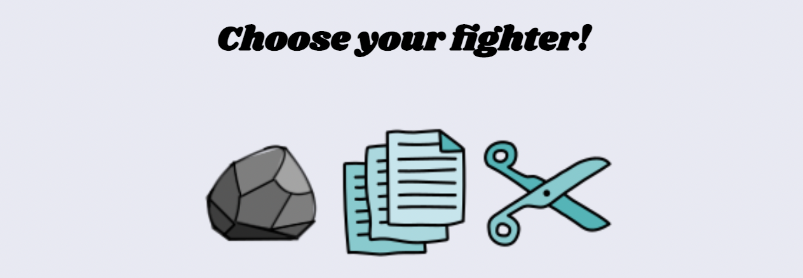
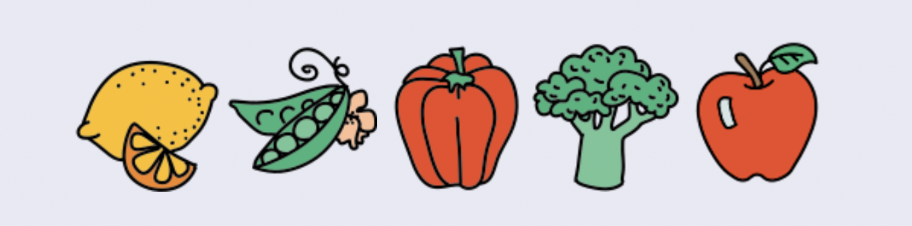

# **Rock Paper Scissors**

## Table of Contents

* [Overview](#overview)
* [Local Setup Instructions](#local-setup-instructions)
* [Using the App](#using-the-app)
* [Code Architecture](#code-architecture)
* [Technologies Used](#technologies-Used)
* [Contact](#contact)
* [Acknowledgements](#acknowledgements)

## Overview

Rock, Paper, Scissors was assigned as the final project for Module 1 at Turing School of Software and Design. The purpose of the application is to create a game where a user can play Rock, Paper, Scissors  against the 'robot'.

In Rock, Paper, Scissors, there are three choices of objects/fighters to chose from: Rock, Paper, Scissors. Each player, in this case a user and the 'robot', chooses a fighter and the icon of each appears on the screen. The comparison of chosen fighters declares a winner or that the round was a draw. A win counter on either side of the game play area increments by one based on rounds won. The user can also choose to play 'Produce Party!', a difficult version of Rock, Paper, Scissors with five objects/fighters to chose from: Lemon, Peas, Pepper, Broccoli or Apple. The user can switch between game modes and their score persists between them. If the user would like to reset their score, they can refresh the page.

The spec for this project can be found [here](https://frontend.turing.edu/projects/module-1/rock-paper-scissors-solo.html).

### Local Setup Instructions

- From this repository, click the code button and copy the SSH link.
- Open terminal by pressing command + space bar, and search for terminal
- Inside of you terminal type "git clone" and then paste the ssh link should look like git clone
- In your terminal type "cd rock-paper-scissors"
- Then type "open index.html"
- The browser should then deploy a playable site.

### Using the App

Here is a gif of how the game works.

* Once the user clicks on Classic or Produce Party (_difficult_), the available options of 'fighters' appears.
   
   

* Then they can select which one they'd like to play which will trigger the 'robot' player to randomly select a fighter.
* If the user and the 'robot' have the same fighter, the round is a draw. Otherwise the winner's icon is displayed in the message under the header.
* The round then resets once the fighters have been evaluated and a new round is started.

### Code Architecture

* **Main.js**
  * The main.js file is primarily used to manipulate the DOM using methods that were created inside of the Game class. By instantiating the new instance of Game inside of this file, I am able to access the "logic" methods that live in the data model and am able to use the data model to manipulate the DOM to show how the game is being played.
  * I used the main.js file strictly for DOM manipulation in order to make sure I am separating the DOM from the data model. I did not want to cross-pollinate those files. The DOM is only showing what my data model is telling it to do.

* **Player.js**
  * The player.js file creates a "Player" class along with a constructor containing its properties that is used when the game starts on page load and two new instances of the Player class are created. There is a takeTurn method that allows the 'robot' to effectively 'take a turn' by randomly selecting a fighter object that holds the rule logic within it.

* **Game.js**
  * The game.js file is the "brains" behind the game that contains the logic needed to evaluate the game properly. The game file also creates a "class" of Game along with a constructor and properties for the game. The methods in the class relate to setting the game type, evaluating the game (comparing two fighters to determine a winner) and reset the game for each round a user would like to play without losing the won games count.

### Technologies Used

This project was written using HTML, CSS, and JavaScript

### Contact

[Angele Williams](https://github.com/angelewilliams)

### Acknowledgements

* Mentor code review with Kelsie Besinger-Yeh.
* Icons source: icons8.com
